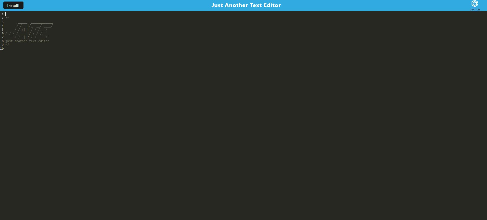

# Text Editor

## Description

[Github Link](https://github.com/HCTyler/NoteTaker)
[Heroku Link](https://texteditorforucsdbootcamp.herokuapp.com/)

This is a single page application using webpack that can be used offline and installed as a PWA.

## Table of Contents

[Installation](#installation)

[Usage](#usage)

[Credits](#credits)

[License](#license)

## Installation

To install necessary dependencies for this project, run the following command:

> npm install

> npm run build

## Usage

npm run start

## Credits

UCSD coding bootcamp

## License

This project is licensed under the MIT license.

## Questions

If you have any other questions about the repo, contact me at undefined. You can find more of my work at [HCTyler](https://github.com/undefined)
